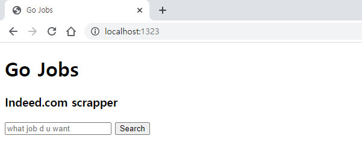

# go-jobs
web scrapper (kr.indeed.com) using "Go" language.

learn Go with Nomad Coders
link: [go-for-beginners](https://nomadcoders.co/go-for-beginners/lobby)

## How to use

1. Execute 
```
go run main.go
```

2. Type "http://localhost:1323/" in web-browser search panel

3. Search job


4. Check the file "jobs.csv"